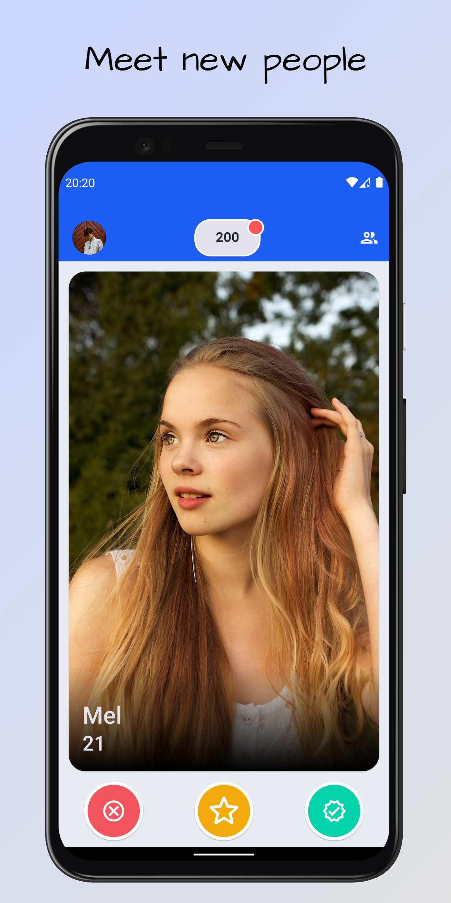
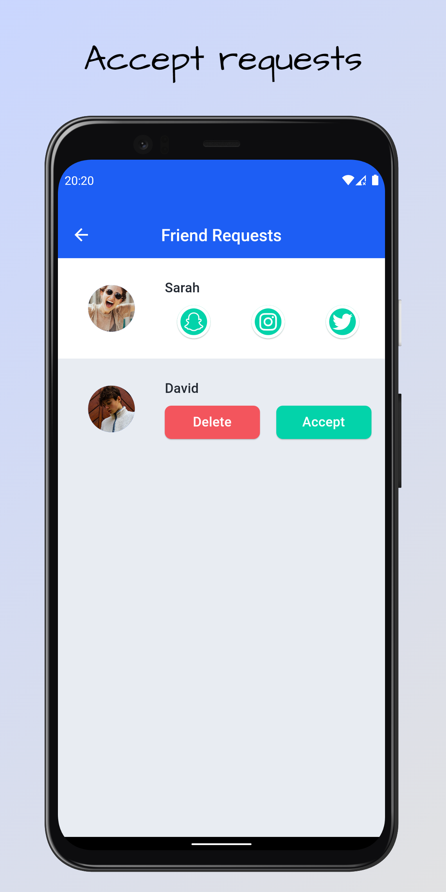
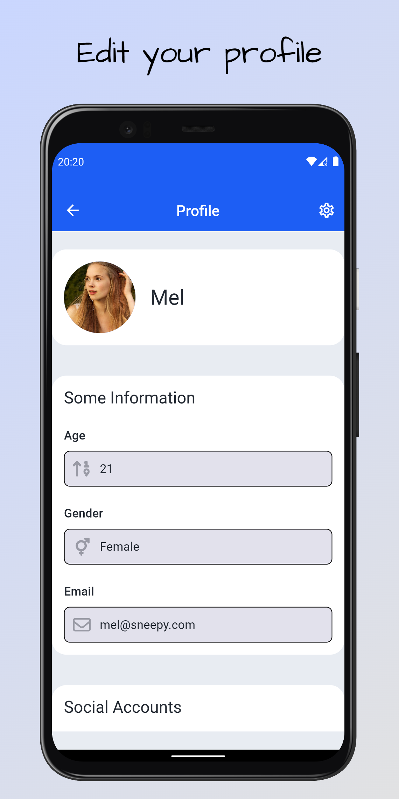

# Sneepy

A matching app.

## Tech and Libraries

- State Management: [Mobx](https://pub.dev/packages/mobx)
- Database: [Hive](https://pub.dev/packages/hive)
- Network: [Dio](https://pub.dev/packages/dio)
- Localization: [Easy Localization](https://pub.dev/packages/easy_localization)
- Purchase: [Revenuecat](https://pub.dev/packages/purchases_flutter)
- Notification: [OneSignal](https://pub.dev/packages/onesignal_flutter)
- Ads: [Google Mobile Ads](https://pub.dev/packages/google_mobile_ads)

## Play Store

## Screenshots

<table>
  <tr align="center">
    <td>Home Screen</td>
    <td>Friends Screen</td>
    <td>Profile Screen</td>
  </tr>
  <tr align="center">
    <td></td>
    <td></td>
    <td></td>
  </tr>
 </table>
